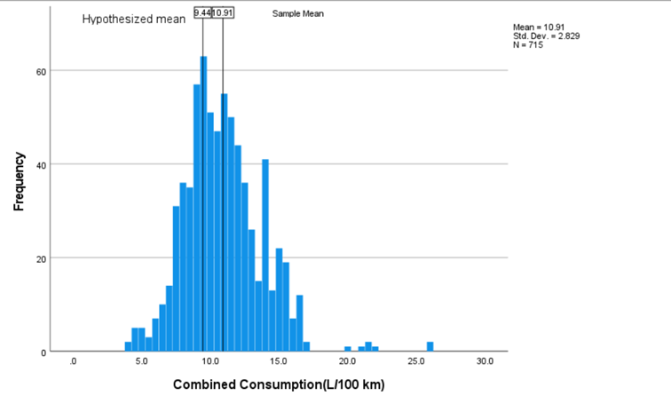

# **Fuel Consumption Ratings 2022**

**Hamza Bacara**

I Have obtained our data from "Kaggle.com". Data has quantitative and
qualitative data. We have downloaded the .csv file and cleansed the data
such as deleting duplicate values using excel, below there is the
previous version of the data that is not cleaned you can see it as the
excel version.

We have 716 unique values in column "Model" to comply with project
requirements.

**About This Dataset**

*Make:* Manufacturer/Brand

*Model:* Unique vehicle model type:

-   4WD/4x4 = Four-wheel drive

-   AWD = All-wheel drive

-   FFV = Flexible-fuel vehicle

-   SWB = Short wheelbase

*Vehicle Class:* Car Vehicle Class

*Engine Size:* Engine size in liters

*Cylinders:* Number of cylinders in a car

*Transmission:*

-   A = Automatic

-   AM = Automated Manual

-   AS = Automatic with select shift

-   AV = Continuously variable

-   M = Manual

-   3-10 = Number of gears

*Fuel Consumption: City and Highway fuel consumption ratings are shown
in liters per 100 kilometers (L/100km) --* The combined rating reflects
55% city and 45% highway driving.

*Co2 Emissions: The tailpipe emissions of carbon dioxide (in grams per
kilometer) for combined city and highway driving.*

*Co2 Rating: The tailpipe emissions of carbon dioxide are rated on a
scale from 1 (worst) to 5(best).*

*Smog Rating: The tailpipe emissions of smog-forming pollutants are
rated on a scale from 1(Worst) to 5 (Best).*

**Data Preparation**

As you can see in below, we have 14 variables. Originally, we had 15
variables. We ended up with 14 variables and 6 quantitative data. We
have uploaded our dataset from excel to SPSS 28 environment and we have
edited our data according to our project requirements.

Below, we have added values to Co2 Rating and Smog rating variables, and
we have changed some of the Label names. Due to project requirements, we
have enough quantitative variables which is good enough for descriptive
tests and hypothesis tests.

Above, we have changed *Co2 Rating*, and *Smog Rating* column from
quantitative to qualitative to suit to project requirements.

**Data Understanding**

Our goal is to conduct various tests inside our dataset and compare
samples. Regarding Co2 Emissions, and Fuel consumptions we will compare
these columns depending on Fuel types.

Firstly, let us see Simple Histogram for **Combined Fuel Consumption**

Above we see the Combined Fuel consumption, we can say that the
distribution is right skewed, Above, we have extreme values as you can
see in the 5 blue columns on the most right, we can say that they are
far away from the mean consumption. In our histogram maximum value is
**26.1** and minimum value is **4.0**, according to our histogram we
have **7 peaks.** The **mean value is 10.906** and **Std deviation** is
**2.829** in **715** observations. Regarding Descriptive statistics we
have 0.799 skewness we are confident to say that this histogram is
positively skewed, by statistical values we support our visual data
analysis.

**Let us make comparison between City and Highway consumption for SUV:
Small vehicle class**

For Highway Consumption we have average fuel consumption of 8.39 and
standard deviation of 1.345 out of 153 observations. We have 2 extreme
values (near the value of 14.0). Also, we have 1 peak value. However, by
looking at statistical values our kurtosis for this histogram is 3.65
which means that is a leptokurtic distribution it is highly peaked.

As we can see from above, for Urban Consumption, we have 1 extreme value
(column 16.0). We have 3 peaks. Our mean is 10.44 and standard deviation
of 1.899. Distribution is symmetric depending on our extreme value and
to our statistical output which skewness is 0.016 and our kurtosis is
1.05 which means this distribution is slightly too peaked. Also, we can
say that SUV: small class has high City Consumption than Highway
Consumption.

**Let us compare Urban fuel consumption and Highway fuel consumption
regarding Fuel Types**

Before we compare the 2 samples, we should know that in general, average
highway consumption is less than city(urban) consumption. That is
because in the city, we stop at traffic lights, this pause causes more
fuel consumption. In other words, the stationary vehicle uses more fuel
because it is not at a constant speed.

**We assume this information is correct depending on our Histograms
regarding our dataset.**

 

As we can see in the above. Highway consumption have 8.6 average
consumption it has no gaps and no extreme values. It is positively
skewed. We have 6 peak points.

For Urban Consumption we have average 10.84 consumption of liters, it
has 9 peak points, standard deviation of 3.09 and it is positively
skewed. Also, we do not see any extreme values nor gaps.

Clearly average means of both consumptions are different with the same
observation of data, and we can easily say that Urban(city) fuel
consumption is higher than Highway consumption regarding the Regular
gasoline Fuel Type.

-   Urban Consumption and Highway consumption for Premium Gasoline:

 

 For Urban Consumption Average Consumption is 13.51, also it is
 positively skewed, there are 4 extreme values and a Standard deviation
 of 3.35. We have 3 peaks.

For Highway Consumption Average consumption is 9.73, and the standard
 deviation is 2.01 out of 386 observations. We have 2 peaks. We can say
 that by visual analysis that our

 With this comparison, we understand that City consumption is higher
 than Highway consumption using Premium Gasoline Fuel Type. We have
 provided a piece of information on what causes this at the beginning
 of comparison.

-   Urban Consumption and Highway consumption for Diesel:

    -   Unfortunately, due to the lack of data in our dataset, we cannot
        make enough observations or assumptions.

**Summary:**

Depending on each observation we made, we are confident that overall
Urban(city) consumptions are higher than Highway consumptions
 regarding Fuel Type's.

Let us Compare Fuel Type's by their Co2 Emissions using box
plot

1.  **Comparing:**

    a.  Are the medians equal for Regular gasoline and Premium gasoline?

    b.  Does interquartile ranges same?

    c.  What is the skewness of each Fuel Type?

    d.  Summary

A-) For Diesel Type Mean is **271.1,** For Regular gasoline **230.85**,
and for Premium gasoline it is **276.33**. However, by visual analysis
we can say that Premium Gasoline and Diesel have the same mean.

B-) For Diesel fuel type our interquartile range is **19**. For Regular
Gasoline, our interquartile range is **84** and lastly, for Premium
gasoline our interquartile range is **93**. Depending on this
statistical variable we are sure that Interquartile ranges are not the
same.

C-) For **Regular Gasoline**, we have wider distribution and symmetrical
skewness. For **Premium gasoline**, our box plot shows us that there is
positive skewness and wider distribution. For **Diesel** we have narrow
distribution and positive skewness. We have made conclusion depending on
statistical variables such as for **Regular Gasoline** our skewness is
**0.329**. For **Premium Gasoline** skewness is **1.33** and For
**Diesel** it is **1.05**

D-) For **Premium** **gasoline** we have **5 outliers**, and we are
confident that it has a greater **Co2 emission** rather than **Diesel**.
However, if we compare **Regular** and **Premium** gasoline's Regular
gasoline has a greater range than **Premium**. We can say that **Regular
gasoline** is used more than **Premium gasoline**. Depending on
statistical analysis Premium gasoline has many Co2 Emissions than
Premium. Depending on Means we can say that Premium gasoline has the
highest Co2 Emission after that our second Highest is Diesel and last is
Regular gasoline. We are **95% confident** that **Regular gasoline is
most safe for environment**. Also, if we look at Diesel fuel type, we
can see its range is low, depending on this analysis we are assuming
that Diesel has high Co2 Emission by its range in other words Diesel has
less usage, however, high Co2 emissions regarding its usage.

**Finally, we can see our Pie chart for Co2 emissions with Co2 ratings**

As we can see from our pie chart, we have defined Total Co2 emissions
from our population and total Co2 ratios. We can clearly see that the
\"Bad\" and \"Normal\" ratings for Co2 emissions, in general, make up
the majority slice in our population pie chart. This means that the
emissions from vehicles are not good enough for our environment. Also,
we can clearly see in our population pie chart that "Very Good" and
"Good" grades are in the minority. From this observation, we can
understand that the overall vehicle ratings are not good enough for the
environment, regardless of the fuel used. In other words, nearly more
than half of our population pie chart has high Co2 emissions to our
environment, if we assume "Very bad" and "Bad" ratings as one rating for
Co2 Emission.

**Let us analyze pie charts for Regular gasoline and Premium gasoline
and later let us compare both population pie charts regarding Co2
Emissions.**

As we can see from the Pie chart for premium gasoline, it has a "Bad"
rating of 52.07 percent in terms of Co2 values and emissions. We can
understand that Vehicles using Premium Gas have bad ratings overall, but
we can see visual data showing us that 32.81 percent which is the
minority have a "Normal" rating, which means there are Co2 emissions
that we can consider not so bad, regardless of engine
size.

Regarding vehicles that use Regular gasoline, our Co2 Ratings show us
that the Majority of 43.36% percent is "Normal". It is followed by a
"Bad" rating of 37.66% percent. By This observation, if we add a "Very
Bad" rating of 4.81% percent to a "Bad" rating we can easily say it is
nearly in the balance between Normal and Bad ratings. However, regular
gasoline is fairly Normal for our environment regardless of engine size.

**Summary Comparison of two pie charts**

We can understand from these two observations that Premium gasoline has
a worse rating than Regular gasoline, in other words, Regular gasoline
regarding their Co2 emission is more balanced ratios than Premium
Gasoline. When we look at premium gasoline it is a highly bad ratio for
Co2 emissions(g/km), so we assume regular gasoline is much better for
our environment.

**Hypothesis Testing's:**

**Bivariate Pearson Correlation:**

We want to see if there is any correlation between Combined fuel
consumption(L/100km) and Engine size(L). Also, we are curious about our
data, so we wanted to do this test.

Before we look at the bivariate Pearson Correlations, we should look at
the scatterplots of our variables to get an idea of what to expect. We
need to determine if its reasonable to assume that our variables have
linear relationships.

In the picture above, we can see that as Combined Consumption increases,
also Engine size tends to increase. There does appear to be some
positive linear relationship.

Let us describe our null hypothesis of the significance test for
correlation. This can be expressed depending on whether a one-tailed or
two-tailed test. We will use two-tailed test with the significance alpha
level of 0.05

two-tailed significance test:

H0: p=0 ("The population correlation coefficient is 0; there is no
association between variables")

H1: p != 0 ("The population correlation coefficient is not 0; a non-zero
correlation could exist")

**Where p is the population correlation coefficient.**

**Correlation can take on any value in the range of \[-1, 1\]. The sign
of the correlation coefficient indicates the direction of the
relationship, while the magnitude of the correlation (how close it is to
-1 or +1) indicates the strength of the relationship.**

**-1: perfectly negative linear relationship**

**0: no relationship**

**+1: perfectly positive linear relationship**

**Also,**

**.1 \< \|r\| \< .3 small/weak correlation**

**.3 \< \|r\| \< .5 medium/moderate correlation**

**.5 \< \|r\| ...... large/strong correlation**

Above, in the scatter plot we assumed there is some linear relationship,
let us support if this relationship is strong or not.

As we can see in the Combined Consumption(L/100km) Row, we have
**Pearson correlation for Combined consumption (with itself) is 1**,
this means it is perfectly relational **with itself**.

Also, we can see from **Engine size(L) row and Engine size(L) Column**
that **Pearson Correlation is 1**, this also means **Engine size(L)**
perfectly relational **with itself**. This is because a variable is
always perfectly correlated with itself.

Now for Correlation of **Combined consumption row** and **Engine Size(L)
Column** we can see that **correlation is 0.823** (r = 0.823 from the
scatter plot if we take the R^2^ to R we will get the same result) based
on 715 observations with pairwise nonmissing values.

Also, for correlation of Engine Size(L) Row and Comb Fuel Consumption
Column is 0.823 (r = .823), based on observations with pairwise
nonmissing values.

We have opted to flag significant correlations; SPSS marked a 0.01
significance level with two asterisks (\*\*).

**Decision and Conclusions**

**Based on the results, we can state the following:**

-   **Combined Fuel consumption and Engine Size(L) have a statistically
    significant linear relationship (r= 0.823, p \< .001).**

-   **The direction of the relationship is positive (i.e., Comb
    consumption and Engine size are positively correlated), meaning that
    these variables tend to increase together (i.e., greater consumption
    is associated with greater engine size). (0 \< r \< 1)**

-   **The magnitude, or the strength, of the association is
    approximately strong (.5 \< \|r\| \< 1) (r = .823)**

-   **In other words, when we squared our Pearson's correlation (0.823)
    and multiply it with 100 we obtain 67.73% shared variance.**

    -   **So forth we reject our Null hypothesis and accept alternative
        hypothesis that there is strong relationship between 2 variables
        (engine size and comb consumption).**

**One-sample Test:**

We have a null value of hypothesis that average combined fuel
consumption is equal to 9.44 L/100km according to United States
Environmental Protection Agency (US EPA) regardless fuel type, which
gives us the opportunity to compare this value with one sample t-test in
IBM SPSS. This will be conducting a two tailed with the alpha value of
0.05 (5%)

Before we make sample t-test let us create a histogram of the data to
get an idea of the distribution, and to see if our hypothesized mean is
near our sample mean.

From the histogram, we can see that combined consumption is relatively
symmetrically distributed about the mean, though there is a slightly
longer right tail. The reference lines indicate that sample mean is
slightly greater than the hypothesized mean, but not by a huge amount.
It is possible that our test result could come back significant.

Let us describe our hypothesis:

H0: Combined Fuel Consumption = 9.44 L/km

H1: Combined Fuel Consumption != 9.44 L/km

We can see from One-sample statistics that we have basic information
about our sample. In above example, the mean Combined fuel consumption
is 10.906 L/100km, which is based on 715 non-missing observations.

The second picture, One-Sample Test, displays the results most relevant
to the one sample t test.

We can see our Test Value = 9.44 which the number we entered as the test
value in the One-sample T Test window. The **t statistic** of the
one-sample t test, denoted t. Above, t= 13.850. We know that t is
calculated by dividing the mean difference (from the t-test box) by the
standard error mean (from the one-sample statistics box). We know that
**df** means the **degrees of freedom** for the test. For a one-sample t
test, df = n-1 so regarding to above, **df** = **714**

Our significance (one-sided p and two-sided p): The p-values
corresponding to one of the possible one-sided alternative hypotheses in
our case µ~Consumption~ \> 9.44 and two-sided alternative hypothesis
µ~Consumption~ ≠ 9.44, respectively. We are only interested in the
two-sided alternative hypothesis.

**Decision:**

**T = 13.850 \> T0.05 (714) = 1.96 (approximately)**

Let us recall that our hypothesized population value was 9.44 L/100km,
the average consumption of the overall vehicle usage in the U.S since
our p\< .001, we reject the null hypothesis that the mean combined fuel
consumption is equal to the hypothesized population mean of 9.44 L/100km
and conclude that the mean consumption is significantly different. In
other words, significantly we will **accept the alternative
hypotheses.**

**Independent t-test:**

-   Let's do an independent samples t-test via IBM SPSS we will compare
    Fuel Type "Regular Gasoline" and "Premium Gasoline" to see if their
    Co2 Emissions (grams per km) is significantly similar or different,
    we are conducting and independent samples t test due to Fuel Type
    "Premium Gasoline" and the Fuel type "Regular Gasoline" has their
    own independent mean values from Co2 tailpipe emissions they have.
    The test will be two tailed test with the alpha value of 0.05 (5%)

 +H0: Mean Co2 emission 'Regular Gasoline' = Mean Co2 Emission 'Premium
 Gasoline'

 +H1: Mean Co2 Emission 'Regular Gasoline' != Mean Co2 Emission
 'Premium Gasoline'

 Let's see our SPSS results below for independent t-test.

 

 We can see that we have sample population of **386** observations for
Fuel type **'Premium Gasoline'** and sample population of **311**
 observations for fuel type '**Regular Gasoline**'. The mean value for
'Regular Gasoline' type is **230.85**(in grams/km) also the mean value
of 'Premium Gasoline' is **276.33**(in grams/km). Now, we will look at
 the variances for choosing which test we should use for this
 hypothesis (Welch's test or two sample t-test) we decide this by using
 Levene's test.

 Independent t-test hypothesis:

 Let's describe our Levene's Test 19.321/3.721

 +H0: Variance of Co2 Emission For 'Regular Gasoline' = Variance of Co2
 Emission for 'Premium Gasoline'

 +H1: Variance of Co2 Emission For 'Regular Gasoline' != Variance of
 Co2 Emission for 'Premium Gasoline'

 We have significance level of Alpha = 0.05 and as we can see from our
 picture above in the "Levene's test for equality of variances" column
 we have **0.358 of significance**. Our **P (0.358)** value \> Alpha
 (0.05).
 For the F test the results from the table is approximately **F*0.05
 ***(385,310) = **1.023** and the **F value** is **0.846.** We can
 understand that **F\< F*0.05 ***(385,310) meaning that we will use two
 sample t-test.

 From this statistical observation we do not reject the null
 hypothesis. In other words, we assume our fuel types has the equal
 variances.

 For the independent samples t-test let us see if \|t\|\>t*0.05* (695)
 where t = **9.477** and **t*0.05*** (695) = **1.96. We can confirm
 that t\> t*0.05*** we reject the null hypothesis. So forth, we accept
 the alternative hypothesis.

 Let us create simple error bar with the %95 CI for Co2 emissions
 Regarding 'Regular' and 'Premium' Gasoline

 **We can see emissions for Regular gasoline are lower than for Premium
 gasoline. Also, we can see that bottom of the taller error bar does
 not overlap with the top of the shorter error bar (Regular gasoline)
 which gives us that the two groups are significantly different.**

 **Summary of Fuel Consumption Ratings 2022 Analysis**

 In this analysis of fuel consumption ratings from 2022, the research
 delved into a dataset obtained from Kaggle.com. With 716 unique
 vehicle model types post-cleansing, the data encompassed both
 quantitative and qualitative attributes. Key features included vehicle
 make, model, class, engine size, number of cylinders, transmission
 type, fuel consumption ratings, CO2 emissions, and environmental
 impact ratings (CO2 and smog).

 **Primary Observations**

 1\. **Fuel Consumption:** The histogram showed combined fuel
 consumption to be right-skewed, with urban consumption typically
 surpassing highway consumption. This pattern was consistent across
 different fuel types, except for Diesel which had limited data.

 2\. **CO2 Emissions:** A box plot comparison of CO2 emissions across
 fuel types highlighted that vehicles using Premium Gasoline and Diesel
 have almost equivalent mean CO2 emissions. However, Premium Gasoline
 showed outliers suggesting potential higher emissions than Diesel.

 3\. **Environmental Impact:** Pie charts revealed a majority of
 vehicles to have high CO2 emissions, especially those using Premium
 Gasoline. Regular gasoline vehicles presented a more balanced
 environmental impact.

 4\. **Correlation Analysis:** A strong positive correlation was found
 between combined fuel consumption and engine size, suggesting that
 larger engines typically consume more fuel.

 5\. **Hypothesis Testing:** The author undertook a one-sample t-test
 and deduced that the mean combined fuel consumption was significantly
 different from the hypothesized population mean. An independent t-test
 between \'Regular Gasoline\' and \'Premium Gasoline\' further
 emphasized that \'Premium Gasoline\' vehicles have significantly
 higher CO2 emissions than their \'Regular Gasoline\' counterparts.

 **Conclusions**

 Given the evidence, author concluded that vehicles using Regular
 gasoline tend to be more environmentally friendly compared to those
 using Premium gasoline. The research also underscored the correlation
 between engine size and fuel consumption, highlighting the
 environmental implications of larger engines.
