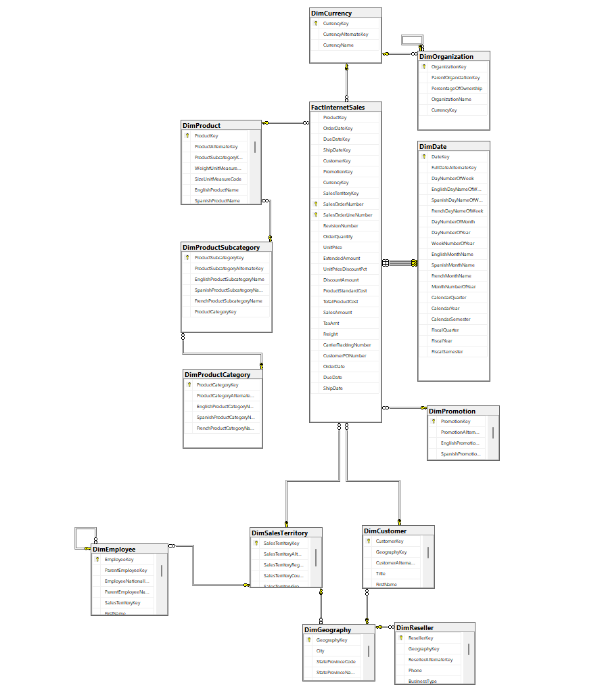
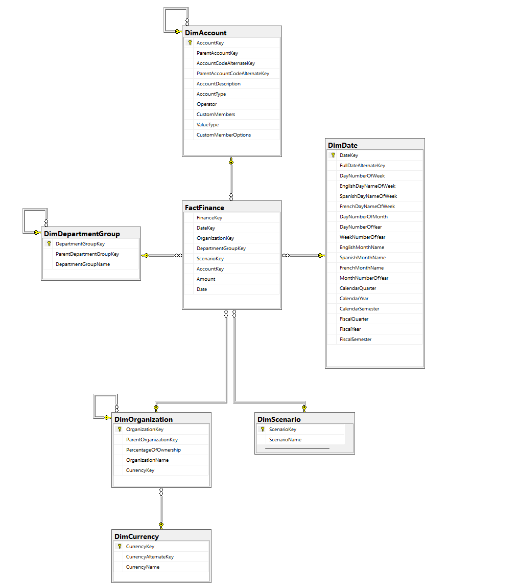
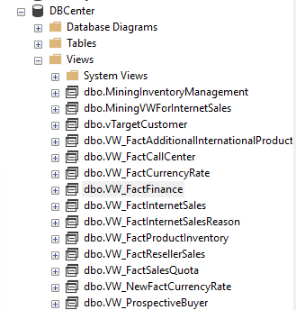
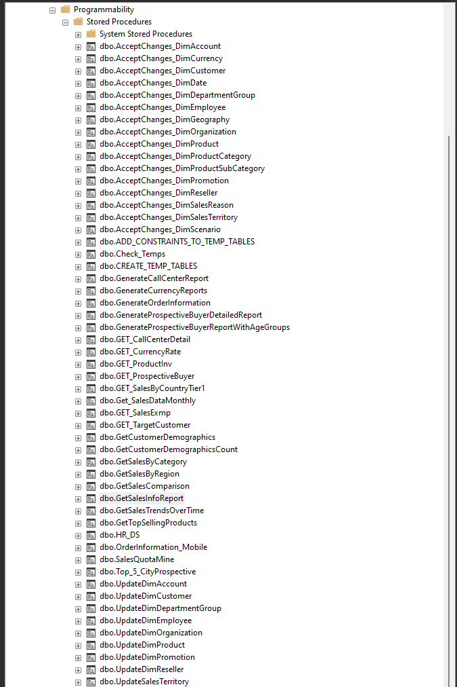

# ELT Integration Project

## Project Overview
This project demonstrates an ELT (Extract, Load, Transform) process using SQL Server Integration Services (SSIS). The process extracts data from various sources, loads it into a staging area, and transforms it into a format suitable for reporting and analysis.

## Repository Contents
- **Warehouse11.sln**: Solution file for the SSIS project.
- **dtsx metadata.txt**: Metadata and configuration details for the SSIS packages used in this project.

## Data Warehouse Purpose
The data warehouse serves as a central repository for storing and organizing data from multiple sources. It is designed to support reporting, analysis, and decision-making processes for business users and stakeholders.

### Dimensional Model
The dimensional model is a data modeling technique used in data warehousing. It organizes data into dimensions (e.g., Date, Customer, Product) and fact tables (e.g., Survey_Response, FactCurrencyRate). Dimensions provide descriptive attributes for analysis, while fact tables store the measurable metrics.

### ERD
### FactFinance Dimensional Model

This image illustrates the dimensional model for the FactFinance table in the data warehouse. The model is structured to support the analysis of financial data across various dimensions.

- FactFinance: The central fact table storing financial metrics, such as FinanceKey, DateKey, OrganizationKey, DepartmentGroupKey, ScenarioKey, AccountKey, Amount, and Date.
- DimAccount: A dimension table containing account details, connected to FactFinance via AccountKey. It includes attributes such as AccountDescription, AccountType, Operator, CustomMembers, and ValueType.
- DimDate: A dimension table containing date-related attributes, connected to FactFinance via DateKey. It includes attributes like FullDateAlternateKey, DayNumberOfWeek, and various month and year-related fields.
- DimDepartmentGroup: A dimension table detailing department groups, connected to FactFinance via DepartmentGroupKey. It includes attributes like DepartmentGroupName and ParentDepartmentGroupKey.
- DimOrganization: A dimension table providing organizational information, connected to FactFinance via OrganizationKey. It includes attributes like OrganizationName, ParentOrganizationKey, and PercentageOfOwnership.
- DimScenario: A dimension table that describes different financial scenarios, connected to FactFinance via ScenarioKey. It includes the ScenarioName attribute.
- DimCurrency: A dimension table containing currency details, connected to DimOrganization via CurrencyKey. It includes attributes like CurrencyAlternateKey and CurrencyName.

### FactFinance Dimensional Model

This image depicts the dimensional model for the FactInternetSales table in the data warehouse. This model is designed to facilitate the analysis of internet sales data across multiple dimensions.

- FactInternetSales: The central fact table capturing internet sales data, including attributes like OrderDateKey, DueDateKey, ShipDateKey, CustomerKey, ProductKey, 
- SalesTerritoryKey, OrderQuantity, and various pricing and shipping details.
- DimProduct: A dimension table with product details, connected to FactInternetSales via ProductKey. It includes attributes such as ProductAlternateKey, WeightUnitMeasureCode, and various product names.
- DimProductSubcategory: A dimension table detailing product subcategories, connected to DimProduct via ProductSubcategoryKey. It includes attributes like EnglishProductSubcategoryName and SpanishProductSubcategoryName.
- DimProductCategory: A dimension table containing product categories, connected to DimProductSubcategory via ProductCategoryKey. It includes attributes like EnglishProductCategoryName and SpanishProductCategoryName.
- DimCurrency: A dimension table with currency details, connected to FactInternetSales via CurrencyKey. It includes attributes like CurrencyAlternateKey and CurrencyName.
- DimOrganization: A dimension table providing organizational information, connected to FactInternetSales via OrganizationKey. It includes attributes like OrganizationName, ParentOrganizationKey, and PercentageOfOwnership.
- DimDate: A dimension table containing date-related attributes, connected to FactInternetSales via multiple date keys (OrderDateKey, DueDateKey, ShipDateKey). It includes attributes like FullDateAlternateKey, DayNumberOfWeek, and various month and year-related fields.
- DimSalesTerritory: A dimension table describing sales territories, connected to FactInternetSales via SalesTerritoryKey. It includes attributes like SalesTerritoryRegion, SalesTerritoryCountry, and SalesTerritoryGroup.
- DimCustomer: A dimension table containing customer information, connected to FactInternetSales via CustomerKey. It includes attributes like GeographyKey, CustomerAlternateKey, and various personal details (e.g., FirstName, LastName, BirthDate).
- DimGeography: A dimension table providing geographical data, connected to DimCustomer via GeographyKey. It includes attributes such as City, StateProvinceCode, and CountryRegionCode.
- DimReseller: A dimension table containing reseller information, connected to DimGeography via GeographyKey. It includes attributes such as ResellerAlternateKey, Phone, and BusinessType.
- DimPromotion: A dimension table that includes promotion details, connected to FactInternetSales via PromotionKey. It includes attributes like EnglishPromotionName and SpanishPromotionName.
- DimEmployee: A dimension table containing employee details, connected to DimSalesTerritory via SalesTerritoryKey. It includes attributes like EmployeeNationalIDAlternateKey, ParentEmployeeKey, and SalesTerritoryKey.

**Summary** In both ERDs, the star schema methodology is used, centralizing the fact tables (FactFinance and FactInternetSales) and connecting them with related dimension tables. This design supports efficient querying, data analysis, and reporting, making it ideal for data warehousing environments. The relationships between entities ensure data integrity and provide a structured way to analyze complex business metrics.

### ELT Process
The Extract, Load, Transform (ELT) process is used to populate the data warehouse.
- **Extraction**: Involves extracting data from the AdventureWorks database and flat files.
- **Loading**: Involves loading the extracted data directly into the data warehouse without immediate transformation.
- **Transformation**: Takes place within the data warehouse using its processing capabilities to cleanse, filter, and aggregate the data to meet business requirements.

During the ELT process, SQL Server Management Studio (SSMS) is used to design the database schema, procedures, views, and other components.

## Parallel Processing in SSIS
### Multiple Threads
In SSIS, you can configure the package to use multiple threads to execute tasks in parallel. By dividing the workload among multiple threads, each working on a separate task, you can leverage the processing power of your system's CPU and reduce overall execution time. SSIS provides options to control the degree of parallelism, allowing you to specify the number of threads to use.

### Parallel Data Flow Tasks
SSIS allows you to split your data flow into multiple paths and execute them in parallel. For example, if you have multiple fact tables to load, you can create separate data flow tasks for each table and execute them simultaneously. This approach utilizes the available system resources effectively and can significantly speed up the data loading process.

### Benefits of Parallel Processing
- **Improved Performance**: By executing tasks in parallel, you can leverage the processing power of your system and reduce the overall execution time of your SSIS package.
- **Resource Utilization**: Parallel processing enables efficient utilization of system resources like CPU and memory, maximizing their potential.
- **Scalability**: Parallel processing allows for scalability as you can increase the number of threads or data flow paths to handle larger datasets or increased workloads.

## SSIS Package Structure
The SSIS package automates the ELT process, consisting of control flow tasks and data flow tasks that orchestrate the extraction, loading, and transformation of data.

### Control Flow
The control flow manages the execution and sequencing of tasks, ensuring that the ELT process follows the desired sequence and dependencies.
### Sequence of Tasks
# Control Flow Documentation for SSIS Package

The control flow in the SSIS package manages the sequence and execution of tasks within the ELT process. Below is a detailed breakdown of the key tasks and their placements within the control flow:

## Tasks Overview

1. **SQL Task: Create Temp Tables**
   - **Description**: This task is responsible for creating temporary tables that will be used for staging data during the ELT process. These tables are created once, before the iteration over multiple data sets begins.

2. **Truncate Temp Tables**
   - **Description**: This task truncates the temporary tables to ensure they are empty before loading new data. It is executed at the start of each iteration within the loop, ensuring that each data set is processed in a clean state.

3. **Transfer Data to Temp Tables**
   - **Description**: This task transfers data from the source to the temporary tables. It is performed for each data set during the loop iteration, populating the temporary tables with the extracted data.

4. **Exchange Temp Tables with Original Tables**
   - **Description**: This task replaces the original tables with the data from the temporary tables. This ensures that the data in the original tables is updated with the newly processed data from the temporary tables.

5. **SQL Task: Add Constraints to Temp Tables**
   - **Description**: This task adds necessary constraints to the temporary tables, such as primary keys and foreign keys, to maintain data integrity and enforce relational rules.

6. **SQL Task: Cleaning Null Values**
   - **Description**: This task cleans null values in the temporary tables by replacing them with default values or handling them according to the business logic. It ensures data quality and consistency before the data is moved to the final destination tables.

7. **Database Integrity Check**
   - **Description**: This task performs a comprehensive integrity check on the database after all iterations of the loop are completed. It ensures that all data transformations and loads have been conducted accurately and that the database is in a consistent state.

By organizing these tasks within and outside the For Each Loop container, the control flow ensures a structured, efficient, and reliable ELT process. This approach optimizes resource utilization, maintains data integrity, and supports scalable data processing within the SSIS package.

### Data Flow
The data flow tasks handle the movement and transformation of data from source to destination. Example of 1:

### Staging Area
The staging area is an intermediate storage area where data is temporarily stored during the ELT process. It helps in data validation, cleansing, and applying necessary transformations before loading the data into its final tables.

### Dimension and Fact Tables
- **Dimension Tables**: Contain descriptive attributes and hierarchies for analysis (e.g., DimDate, DimCustomer).
- **Fact Tables**: Store the measurable metrics and facts associated with the business processes (e.g., FactCurrencyRate, FactCallCenter).

### Temporary Tables and Views
Temporary tables are created to stage and store data during the ELT process. Views are created to consolidate data from multiple databases or sources.

### Stored Procedures
Stored procedures encapsulate and execute specific logic or calculations on the data. They enhance the functionality and flexibility of the data warehouse for reporting and analysis purposes.

### Integration Result on Power BI

- The integration of SSIS and the data warehouse allows seamless connectivity with Power BI, enabling the creation of comprehensive dashboards like the KPI Controller. These visualizations offer valuable insights into sales performance, cost management, and market trends, thereby supporting data-driven decision-making processes within the organization.
